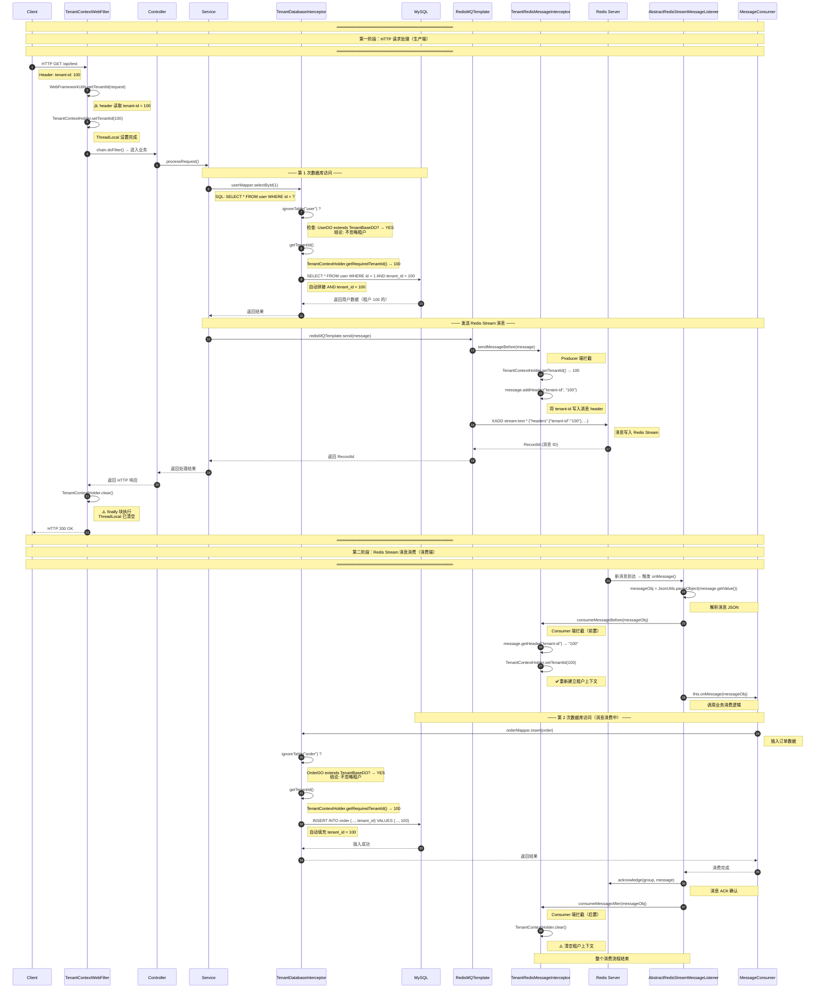

# yudao-cloud 租户上下文生命周期深度分析

## 一、概述

本文档针对 yudao-cloud 项目中 `tenant-id` 从 HTTP header 进入系统后，影响 ThreadLocal 上下文、数据库 SQL 拼接、RPC 和 Feign 请求头以及消息队列生产消费的全链路进行深度分析。

## 二、核心组件架构图

```
HTTP 请求 (header: tenant-id)
        │
        ▼
┌─────────────────────────────────────────────────────────────┐
│                      Web 层过滤器链                          │
│  ┌───────────────────────────────────────────────────────┐  │
│  │ DataPermissionRpcWebFilter (RPC 数据权限恢复)          │  │
│  │  - 读取 header: data-permission-enable                │  │
│  │  - 调用 DataPermissionUtils.executeIgnore()           │  │
│  └───────────────────────────────────────────────────────┘  │
│                            │                                │
│                            ▼                                │
│  ┌───────────────────────────────────────────────────────┐  │
│  │ TenantContextWebFilter (租户上下文入口)                 │  │
│  │  - 读取 header: tenant-id                             │  │
│  │  - 写入 TenantContextHolder.setTenantId()             │  │
│  │  - finally 中 TenantContextHolder.clear()             │  │
│  └───────────────────────────────────────────────────────┘  │
└─────────────────────────────────────────────────────────────┘
        │
        ▼ (租户上下文已建立)
┌─────────────────────────────────────────────────────────────┐
│                      业务层 / Controller                     │
│  ┌───────────────────────────────────────────────────────┐  │
│  │ TenantIgnoreAspect (AOP 忽略租户)                      │  │
│  │  - 读取 @TenantIgnore 注解                            │  │
│  │  - 解析 enable 表达式                                  │  │
│  │  - 写入 TenantContextHolder.setIgnore(true)           │  │
│  │  - finally 恢复旧值 setIgnore(oldIgnore)              │  │
│  └───────────────────────────────────────────────────────┘  │
└─────────────────────────────────────────────────────────────┘
        │
        ├───────────────┬───────────────┬───────────────┐
        ▼               ▼               ▼               ▼
   ┌────────┐      ┌────────┐      ┌────────┐      ┌────────┐
   │  DB    │      │  RPC   │      │  MQ    │      │ Feign  │
   │ 层     │      │ 层     │      │ 层     │      │ 层     │
   └────────┘      └────────┘      └────────┘      └────────┘
```

---

## 三、问题回答

### 问题 1：哪些组件读取 tenant-id，哪些组件写出 tenant-id？

#### 1.1 读取 tenant-id 的组件

| 组件 | 读取位置 | 文件路径 | 代码行 |
|------|---------|---------|--------|
| TenantContextWebFilter | HTTP Header: `tenant-id` | `TenantContextWebFilter.java:25` | `WebFrameworkUtils.getTenantId(request)` |
| TenantDatabaseInterceptor | ThreadLocal | `TenantDatabaseInterceptor.java:42` | `TenantContextHolder.getRequiredTenantId()` |
| TenantRedisMessageInterceptor | Redis 消息 Header | `TenantRedisMessageInterceptor.java:30` | `message.getHeader(HEADER_TENANT_ID)` |
| TenantRocketMQConsumeMessageHook | RocketMQ 消息 UserProperty | `TenantRocketMQConsumeMessageHook.java:35` | `messages.get(0).getUserProperty(HEADER_TENANT_ID)` |
| InvocableHandlerMethod (Kafka/RabbitMQ) | Spring Message Header | `InvocableHandlerMethod.java:133` | `message.getHeaders().get(HEADER_TENANT_ID)` |

#### 1.2 写出 tenant-id 的组件

| 组件 | 写出位置 | 文件路径 | 代码行 |
|------|---------|---------|--------|
| TenantContextWebFilter | ThreadLocal (TenantContextHolder) | `TenantContextWebFilter.java:27` | `TenantContextHolder.setTenantId(tenantId)` |
| TenantRequestInterceptor | Feign 请求 Header | `TenantRequestInterceptor.java:21` | `requestTemplate.header(HEADER_TENANT_ID, ...)` |
| TenantRedisMessageInterceptor | Redis 消息 Header (Producer) | `TenantRedisMessageInterceptor.java:24` | `message.addHeader(HEADER_TENANT_ID, ...)` |
| TenantRedisMessageInterceptor | ThreadLocal (Consumer) | `TenantRedisMessageInterceptor.java:32` | `TenantContextHolder.setTenantId(...)` |
| TenantKafkaProducerInterceptor | Kafka 消息 Header | `TenantKafkaProducerInterceptor.java:30` | `headers.add(HEADER_TENANT_ID, ...)` |
| TenantRocketMQSendMessageHook | RocketMQ 消息 UserProperty | `TenantRocketMQSendMessageHook.java:29` | `putUserProperty(HEADER_TENANT_ID, ...)` |
| TenantRocketMQConsumeMessageHook | ThreadLocal (Consumer) | `TenantRocketMQConsumeMessageHook.java:37` | `TenantContextHolder.setTenantId(...)` |
| TenantRabbitMQMessagePostProcessor | RabbitMQ 消息 Header | `TenantRabbitMQMessagePostProcessor.java:26` | `getHeaders().put(HEADER_TENANT_ID, ...)` |
| InvocableHandlerMethod | 通过 TenantUtils.execute() | `InvocableHandlerMethod.java:129` | `TenantUtils.execute(tenantId, ...)` |

---

### 问题 2：TenantContextHolder.clear 或恢复旧值分别在哪些 finally 中发生？

#### 2.1 clear() 操作的 finally 位置

```
┌──────────────────────────────────────────────────────────────┐
│ clear() - 清空 ThreadLocal (清除 tenantId + ignore)          │
├──────────────────────────────────────────────────────────────┤
│                                                              │
│  1. TenantContextWebFilter (HTTP 请求入口)                   │
│     文件: TenantContextWebFilter.java                        │
│     位置: line 31-34                                         │
│     场景: Web 请求处理完毕，finally 块中                     │
│                                                              │
│     try {                                                    │
│         chain.doFilter(request, response);                   │
│     } finally {                                              │
│         TenantContextHolder.clear();  // line 33             │
│     }                                                        │
│                                                              │
├──────────────────────────────────────────────────────────────┤
│                                                              │
│  2. TenantRedisMessageInterceptor (Redis 消息消费)           │
│     文件: TenantRedisMessageInterceptor.java                 │
│     位置: line 37-40                                         │
│     场景: Redis Stream/Pub/Sub 消息消费后，after 中          │
│                                                              │
│     public void consumeMessageAfter(...) {                   │
│         TenantContextHolder.clear();  // line 39             │
│     }                                                        │
│                                                              │
│     ═══════════════════════════════════════════════         │
│     调用链:                                                  │
│     AbstractRedisStreamMessageListener.onMessage()           │
│       └─ finally 调用 consumeMessageAfter()                  │
│           └─ TenantRedisMessageInterceptor.clear()           │
│                                                              │
├──────────────────────────────────────────────────────────────┤
│                                                              │
│  3. TenantRocketMQConsumeMessageHook (RocketMQ 消费)         │
│     文件: TenantRocketMQConsumeMessageHook.java              │
│     位置: line 41-44                                         │
│     场景: RocketMQ 消息消费后                                │
│                                                              │
│     public void consumeMessageAfter(...) {                   │
│         TenantContextHolder.clear();  // line 43             │
│     }                                                        │
│                                                              │
└──────────────────────────────────────────────────────────────┘
```

#### 2.2 恢复旧值操作的 finally 位置

```
┌──────────────────────────────────────────────────────────────┐
│ 恢复旧值 - 栈式管理 (保存 oldValue → 操作 → finally 恢复)    │
├──────────────────────────────────────────────────────────────┤
│                                                              │
│  1. TenantIgnoreAspect (@TenantIgnore 注解切面)              │
│     文件: TenantIgnoreAspect.java                            │
│     位置: line 26, 36-38                                     │
│     场景: AOP 环绕通知，支持嵌套                              │
│                                                              │
│     public Object around(..., TenantIgnore tenantIgnore) {   │
│         Boolean oldIgnore = TenantContextHolder.isIgnore();  │
│         try {                                                │
│             if (enable 为 true) {                             │
│                 TenantContextHolder.setIgnore(true);         │
│             }                                                │
│             return joinPoint.proceed();                      │
│         } finally {                                          │
│             TenantContextHolder.setIgnore(oldIgnore);        │
│         }                                                    │
│     }                                                        │
│                                                              │
│     特点:                                                     │
│     - 只恢复 ignore，不清空 tenantId                         │
│     - 支持嵌套: 外层 ignore=true，内层 ignore=false          │
│       内层执行完恢复为 true，外层执行完恢复最初值             │
│                                                              │
├──────────────────────────────────────────────────────────────┤
│                                                              │
│  2. TenantUtils.execute() (租户切换)                         │
│     文件: TenantUtils.java                                   │
│     位置: line 26-38 (Runnable 版本)                         │
│           line 50-64 (Callable 版本)                         │
│     场景: 手动切换租户上下文，执行后恢复原租户                │
│                                                              │
│     public static void execute(Long tenantId, Runnable) {    │
│         Long oldTenantId = TenantContextHolder.getTenantId();│
│         Boolean oldIgnore = TenantContextHolder.isIgnore();  │
│         try {                                                │
│             TenantContextHolder.setTenantId(tenantId);       │
│             TenantContextHolder.setIgnore(false);            │
│             runnable.run();                                  │
│         } finally {                                          │
│             TenantContextHolder.setTenantId(oldTenantId);    │
│             TenantContextHolder.setIgnore(oldIgnore);        │
│         }                                                    │
│     }                                                        │
│                                                              │
├──────────────────────────────────────────────────────────────┤
│                                                              │
│  3. TenantUtils.executeIgnore() (忽略租户)                   │
│     文件: TenantUtils.java                                   │
│     位置: line 71-80 (Runnable)                              │
│           line 88-99 (Callable)                              │
│     场景: 临时忽略租户，执行后恢复                            │
│                                                              │
│     public static void executeIgnore(Runnable runnable) {    │
│         Boolean oldIgnore = TenantContextHolder.isIgnore();  │
│         try {                                                │
│             TenantContextHolder.setIgnore(true);             │
│             runnable.run();                                  │
│         } finally {                                          │
│             TenantContextHolder.setIgnore(oldIgnore);        │
│         }                                                    │
│     }                                                        │
│                                                              │
└──────────────────────────────────────────────────────────────┘
```

#### 2.3 clear vs 恢复旧值的区别

| 对比项 | clear() | 恢复旧值 |
|--------|---------|---------|
| 影响字段 | `tenantId` + `ignore` | 仅 `ignore` 或两者 |
| 使用场景 | 作为**入口/出口**的边界清理 (Filter, MQ Consumer) | **嵌套/临时切换** (AOP, TenantUtils) |
| 副作用 | 可能影响外层上下文（不支持嵌套入口） | 完全无副作用（栈式管理） |
| 典型位置 | WebFilter, MQ Consumer 消费后 | AOP 切面, 手动工具方法 |

---

### 问题 3：@TenantIgnore 的 enable 表达式为 false 时是否忽略租户？

#### 3.1 源码分析

```java
// TenantIgnoreAspect.java:24-39
@Around("@annotation(tenantIgnore)")
public Object around(ProceedingJoinPoint joinPoint, TenantIgnore tenantIgnore) throws Throwable {
    Boolean oldIgnore = TenantContextHolder.isIgnore();
    try {
        // 关键：解析 enable 表达式
        Object enable = SpringExpressionUtils.parseExpression(tenantIgnore.enable());
        
        // 关键：只有 Boolean.TRUE.equals(enable) 才设置忽略
        if (Boolean.TRUE.equals(enable)) {
            TenantContextHolder.setIgnore(true);
        }

        // 执行逻辑
        return joinPoint.proceed();
    } finally {
        TenantContextHolder.setIgnore(oldIgnore);
    }
}
```

#### 3.2 结论

**答案：当 enable 表达式为 false 时，不忽略租户。**

```
┌─────────────────────────────────────────────────────────────┐
│               @TenantIgnore.enable 表达式决策表               │
├─────────────────────────────────────────────────────────────┤
│                                                             │
│  enable 表达式求值结果        是否 setIgnore(true)            │
│  ─────────────────────────────────────────────────────     │
│  "true" (字符串)               ✅ 忽略 (Boolean.TRUE)        │
│  true (布尔)                    ✅ 忽略                      │
│  Boolean.TRUE                   ✅ 忽略                      │
│  ─────────────────────────────────────────────────────     │
│  "false" (字符串)              ❌ 不忽略 (不满足条件)         │
│  false (布尔)                   ❌ 不忽略                    │
│  Boolean.FALSE                  ❌ 不忽略                    │
│  null                           ❌ 不忽略                    │
│  其他任意值                     ❌ 不忽略                    │
│                                                             │
├─────────────────────────────────────────────────────────────┤
│  关键代码逻辑：                                              │
│                                                             │
│  if (Boolean.TRUE.equals(enable)) {                          │
│      TenantContextHolder.setIgnore(true);  // 严格匹配 true  │
│  }                                                           │
│                                                             │
│  注意：这是 严格等于 判断，不是布尔求值！                     │
│  表达式结果必须 严格等于 Boolean.TRUE                        │
│                                                             │
└─────────────────────────────────────────────────────────────┘
```

#### 3.3 实际使用场景

```java
// 场景 1: 始终忽略租户
@TenantIgnore  // 等价于 @TenantIgnore(enable = "true")
public void globalTask() {
    // 此时数据库查询 不会 自动添加 tenant_id 条件
}

// 场景 2: 根据配置动态决定
@TenantIgnore(enable = "${yudao.tenant.ignore-some-task:true}")
public void conditionalTask() {
    // 只有配置为 true 时才忽略租户
}

// 场景 3: 基于业务参数（Spring EL）
@TenantIgnore(enable = "#args[0].isAdmin()")
public void processRequest(Request req) {
    // 如果 req.isAdmin() 返回 true，则忽略租户过滤
}
```

---

### 问题 4：ignoreTable 遇到各种情况时分别如何处理？

#### 4.1 处理流程源码

```java
// TenantDatabaseInterceptor.java:46-81

@Override
public boolean ignoreTable(String tableName) {
    // 情况一：全局忽略多租户
    if (TenantContextHolder.isIgnore()) {
        return true;  // 直接忽略，不做任何表级检查
    }
    
    // 情况二：忽略多租户的表
    tableName = SqlParserUtils.removeWrapperSymbol(tableName);
    Boolean ignore = ignoreTables.get(tableName.toLowerCase());
    
    if (ignore == null) {
        // 缓存未命中，动态计算
        ignore = computeIgnoreTable(tableName);
        synchronized (ignoreTables) {
            addIgnoreTable(tableName, ignore);  // 缓存结果
        }
    }
    return ignore;
}

private boolean computeIgnoreTable(String tableName) {
    // 子判断 1: 找不到的表，忽略租户
    TableInfo tableInfo = TableInfoHelper.getTableInfo(tableName);
    if (tableInfo == null) {
        return true;  // 返回 true = 忽略租户
    }
    
    // 子判断 2: 继承 TenantBaseDO = 不忽略
    if (TenantBaseDO.class.isAssignableFrom(tableInfo.getEntityType())) {
        return false;  // 返回 false = 不忽略（需要租户过滤）
    }
    
    // 子判断 3: 有 @TenantIgnore 注解 = 忽略
    TenantIgnore tenantIgnore = tableInfo.getEntityType().getAnnotation(TenantIgnore.class);
    return tenantIgnore != null;  // 有注解返回 true（忽略），否则 false
}
```

#### 4.2 完整决策树

```
┌─────────────────────────────────────────────────────────────────┐
│              ignoreTable(String tableName) 完整决策流程          │
├─────────────────────────────────────────────────────────────────┤
│                                                                 │
│  输入: tableName (可能带反引号或双引号，如 `user` 或 "user")     │
│                                                                 │
│  Step 0: 移除 SQL 包装符号                                      │
│    tableName = SqlParserUtils.removeWrapperSymbol(tableName)   │
│                                                                 │
│  ═══════════════════════════════════════════════════════════    │
│                                                                 │
│  第一优先级：ThreadLocal 全局开关                                │
│  ┌─────────────────────────────────────────────────────────┐   │
│  │ TenantContextHolder.isIgnore() == true ?                 │   │
│  └──────────────────┬──────────────────────────────────────┘   │
│                     │                                          │
│           ┌─────────┴──────────┐                               │
│           │ YES                │ NO                            │
│           ▼                    ▼                               │
│     ┌──────────┐        进入表级别判断                          │
│     │ 忽略租户  │                                              │
│     │ return   │       (继续下面的判断)                         │
│     │ true     │                                              │
│     └──────────┘                                              │
│                                                                 │
│  ═══════════════════════════════════════════════════════════    │
│                                                                 │
│  第二优先级：配置缓存 (ignoreTables Map)                         │
│  ┌─────────────────────────────────────────────────────────┐   │
│  │ ignoreTables 缓存中存在该表名？                           │   │
│  │ (同时查大写和小写)                                        │   │
│  └──────────────────┬──────────────────────────────────────┘   │
│                     │                                          │
│           ┌─────────┴──────────┐                               │
│           │ YES                │ NO                            │
│           ▼                    ▼                               │
│     返回缓存值            调用 computeIgnoreTable()             │
│                         (动态计算并缓存)                        │
│                                                                 │
│  ═══════════════════════════════════════════════════════════    │
│                                                                 │
│  第三优先级：computeIgnoreTable() 动态计算                      │
│  ┌─────────────────────────────────────────────────────────┐   │
│  │ computeIgnoreTable(String tableName) 内部判断流程         │   │
│  └─────────────────────────────────────────────────────────┘   │
│                                                                 │
│  3.1 初始化配置中的表                                            │
│  ┌─────────────────────────────────────────────────────────┐   │
│  │ 构造函数中已添加：                                        │   │
│  │   - properties.getIgnoreTables() 配置的表                 │   │
│  │   - "DUAL" (Oracle 特殊表)                               │   │
│  │ 这些表直接标记为 ignore=true                             │   │
│  └─────────────────────────────────────────────────────────┘   │
│                                                                 │
│  3.2 运行时动态判断                                              │
│  ┌─────────────────────────────────────────────────────────┐   │
│  │                                                         │   │
│  │  3.2.1 TableInfoHelper.getTableInfo(tableName)         │   │
│  │        能否在 MyBatis Plus 注册中心找到该表？            │   │
│  │                                                         │   │
│  │        ┌───────────┬─────────────┐                     │   │
│  │        │ NO        │ YES         │                     │   │
│  │        ▼           ▼             │                     │   │
│  │   ┌────────┐  (继续下一级判断)    │                     │   │
│  │   │ 忽略   │                      │                     │   │
│  │   │ 租户   │                      │                     │   │
│  │   │ return │                      │                     │   │
│  │   │ true   │                      │                     │   │
│  │   └────────┘                      │                     │   │
│  │                                    │                     │   │
│  │  3.2.2 实体类是否继承 TenantBaseDO?                      │   │
│  │                                                         │   │
│  │        ┌───────────┬─────────────┐                     │   │
│  │        │ YES       │ NO          │                     │   │
│  │        ▼           ▼             │                     │   │
│  │   ┌────────┐  (继续下一级判断)    │                     │   │
│  │   │ 不忽略 │                      │                     │   │
│  │   │ 租户   │                      │                     │   │
│  │   │ return │                      │                     │   │
│  │   │ false  │                      │                     │   │
│  │   └────────┘                      │                     │   │
│  │                                    │                     │   │
│  │  3.2.3 实体类是否有 @TenantIgnore 注解?                  │   │
│  │                                                         │   │
│  │        ┌───────────┬─────────────┐                     │   │
│  │        │ YES       │ NO          │                     │   │
│  │        ▼           ▼             │                     │   │
│  │   ┌────────┐   ┌────────┐        │                     │   │
│  │   │ 忽略   │   │ 不忽略 │        │                     │   │
│  │   │ 租户   │   │ 租户   │        │                     │   │
│  │   │ return │   │ return │        │                     │   │
│  │   │ true   │   │ false  │        │                     │   │
│  │   └────────┘   └────────┘        │                     │   │
│  │                                    │                     │   │
│  └────────────────────────────────────┴─────────────────────┘   │
│                                                                 │
└─────────────────────────────────────────────────────────────────┘
```

#### 4.3 具体场景对照表

| 场景 | 实际情况 | 处理结果 | 原因 |
|------|---------|---------|------|
| **未知表** | 表名不在 MyBatis Plus 的 TableInfoHelper 中 | ✅ 忽略租户 | `TableInfoHelper.getTableInfo()` 返回 null，`computeIgnoreTable()` 返回 true |
| **继承 TenantBaseDO** | 实体类 `extends TenantBaseDO` | ❌ **不忽略** (必须有租户过滤) | 明确表示这是多租户表，`isAssignableFrom()` 返回 true → `return false` |
| **@TenantIgnore 在实体类上** | `@TenantIgnore public class UserDO {...}` | ✅ 忽略租户 | `getAnnotation(TenantIgnore.class)` 不为 null → `return true` |
| **配置 ignoreTables** | `yudao.tenant.ignore-tables[0]=system_log` | ✅ 忽略租户 | 构造函数中 `addIgnoreTable(table, true)`，缓存命中 |
| **DUAL 表** | Oracle 数据库的特殊表 | ✅ 忽略租户 | 构造函数中 `addIgnoreTable("DUAL", true)`，硬编码 |
| **ThreadLocal 全局忽略** | `TenantContextHolder.setIgnore(true)` | ✅ **所有表都忽略** | 第一优先级，直接 `return true` |

#### 4.4 SQL 拼接的影响

```
忽略租户 (ignoreTable 返回 true)：
    SELECT * FROM user WHERE id = ?

不忽略租户 (ignoreTable 返回 false)：
    SELECT * FROM user WHERE id = ? AND tenant_id = 100
                                                 ^^^^^^^^^
                                           自动拼接租户条件
```

---

### 问题 5：消息消费异常时 tenant-id 是否可能泄漏？按调用顺序推导

#### 5.1 各消息中间件的消费流程对比

##### 5.1.1 Redis Stream 消费流程

```
┌────────────────────────────────────────────────────────────────────┐
│              Redis Stream 消息消费完整调用链                       │
├────────────────────────────────────────────────────────────────────┤
│                                                                    │
│  AbstractRedisStreamMessageListener.onMessage(record)              │
│  文件: AbstractRedisStreamMessageListener.java:63-79              │
│                                                                    │
│  调用顺序:                                                         │
│  ──────────────────────────────────────────────────────────────   │
│                                                                    │
│  [Line 65]  T messageObj = JsonUtils.parseObject(...)              │
│              ↓ 解析消息（可能抛出 JSON 解析异常）                   │
│                                                                    │
│  [Line 66]  try {                                                  │
│              ↓ 进入 try 块                                         │
│                                                                    │
│  [Line 67]      consumeMessageBefore(messageObj)  ← 租户设置点     │
│                  ↓                                                 │
│                  TenantRedisMessageInterceptor.consumeMessageBefore│
│                      ↓                                             │
│                      String tenantIdStr = message.getHeader(...)   │
│                      if (StrUtil.isNotEmpty(tenantIdStr)) {        │
│                          TenantContextHolder.setTenantId(...)      │
│                      }                                             │
│                                                                    │
│  [Line 69]      this.onMessage(messageObj)  ← 业务消费逻辑         │
│                  ↓ 可能抛出业务异常                                │
│                                                                    │
│  [Line 71]      redisMQTemplate...acknowledge(...)  ← 消息确认     │
│                                                                    │
│  [Line 77]  } finally {                                            │
│                                                                    │
│  [Line 78]      consumeMessageAfter(messageObj)  ← 清理保证        │
│                  ↓                                                 │
│                  TenantRedisMessageInterceptor.consumeMessageAfter │
│                      ↓                                             │
│                      TenantContextHolder.clear();  ← 强制清理      │
│              }                                                     │
│                                                                    │
│  ═══════════════════════════════════════════════════════════════   │
│                                                                    │
│  异常可能抛出的位置分析:                                           │
│                                                                    │
│  位置 1: Line 65 (JSON 解析)                                       │
│    → 在 try 块之前！                                                │
│    → 如果抛出异常：                                                 │
│        ❌ consumeMessageBefore 尚未执行 → ThreadLocal 为空          │
│        ❌ finally 不会执行                                         │
│        ✅ 但此时租户还没设置，所以 无泄漏风险                       │
│                                                                    │
│  位置 2: Line 69 (业务消费)                                        │
│    → 在 try 块之内！                                                │
│    → 如果抛出异常：                                                 │
│        ✅ consumeMessageBefore 已执行 → 租户已设置                 │
│        ✅ finally 一定会执行                                       │
│        ✅ consumeMessageAfter → clear() 执行                      │
│        ✅ 无泄漏风险                                               │
│                                                                    │
│  位置 3: Line 71 (ack 确认)                                        │
│    → 在 try 块之内！                                                │
│    → 如果抛出异常：                                                 │
│        ✅ 同上，finally 执行 clear()                               │
│        ✅ 无泄漏风险                                               │
│                                                                    │
│  ═══════════════════════════════════════════════════════════════   │
│                                                                    │
│  ✅ 结论：Redis Stream 消费异常时，tenant-id 不会泄漏。            │
│     - 所有可能抛出异常的位置（在设置租户后）都在 try 块内           │
│     - finally 确保 consumeMessageAfter 一定执行                    │
│     - consumeMessageAfter 中调用 TenantContextHolder.clear()      │
│                                                                    │
└────────────────────────────────────────────────────────────────────┘
```

##### 5.1.2 RocketMQ 消费流程

```
┌────────────────────────────────────────────────────────────────────┐
│              RocketMQ 消息消费完整调用链                          │
├────────────────────────────────────────────────────────────────────┤
│                                                                    │
│  TenantRocketMQConsumeMessageHook                                 │
│  文件: TenantRocketMQConsumeMessageHook.java:29-44                │
│                                                                    │
│  [Line 30] consumeMessageBefore(ConsumeMessageContext context)     │
│      {                                                            │
│  [Line 35]     String tenantId = messages.get(0).getUserProperty(..) │
│  [Line 36]     if (StrUtil.isNotEmpty(tenantId)) {                │
│  [Line 37]         TenantContextHolder.setTenantId(Long.parseLong(tenantId)); │
│               }                                                   │
│           }                                                       │
│                                                                    │
│  ┌─────────────────────────────────────────────────────────────┐  │
│  │  实际执行业务逻辑 (RocketMQ 框架内部)                         │  │
│  │  可能抛出 Exception                                           │  │
│  └─────────────────────────────────────────────────────────────┘  │
│                                                                    │
│  [Line 41] consumeMessageAfter(ConsumeMessageContext context)      │
│      {                                                            │
│  [Line 43]     TenantContextHolder.clear();                       │
│           }                                                       │
│                                                                    │
│  ═══════════════════════════════════════════════════════════════   │
│                                                                    │
│  ✅ 结论：RocketMQ 消费异常时，tenant-id 不会泄漏。                │
│     - RocketMQ 框架保证 hook 的 consumeMessageAfter 一定会执行    │
│     - 无论业务是否抛出异常，after 都会被调用                      │
│                                                                    │
└────────────────────────────────────────────────────────────────────┘
```

##### 5.1.3 Kafka / RabbitMQ 消费流程 (通过 InvocableHandlerMethod)

```
┌────────────────────────────────────────────────────────────────────┐
│              Kafka / RabbitMQ 消费完整调用链                      │
├────────────────────────────────────────────────────────────────────┤
│                                                                    │
│  InvocableHandlerMethod.invoke(Message<?> message, ...)            │
│  文件: org/springframework/messaging/handler/invocation/...       │
│  Line: 117-130                                                    │
│                                                                    │
│  调用顺序:                                                         │
│  ──────────────────────────────────────────────────────────────   │
│                                                                    │
│  [Line 118] Object[] args = getMethodArgumentValues(...)           │
│              ↓ 解析参数（可能抛出异常）                            │
│                                                                    │
│  [Line 124] Long tenantId = parseTenantId(message);  ← 解析租户ID  │
│              ↓                                                     │
│  [Line 125] if (tenantId == null) {                                │
│  [Line 126]     return doInvoke(args);  ← 无租户，直接执行业务      │
│              }                                                     │
│                                                                    │
│  [Line 129] return TenantUtils.execute(tenantId, () -> doInvoke(args));
│              ↓                                                     │
│              进入 TenantUtils.execute() → 栈式管理                 │
│                                                                    │
│  ═══════════════════════════════════════════════════════════════   │
│                                                                    │
│  TenantUtils.execute(Long tenantId, Callable<V> callable)         │
│  文件: TenantUtils.java:50-64                                     │
│                                                                    │
│  public static <V> V execute(Long tenantId, Callable<V> callable) {│
│      Long oldTenantId = TenantContextHolder.getTenantId();         │
│      Boolean oldIgnore = TenantContextHolder.isIgnore();          │
│      try {                                                        │
│          TenantContextHolder.setTenantId(tenantId);   ← 设置      │
│          TenantContextHolder.setIgnore(false);                    │
│          return callable.call();  ← 业务逻辑，可能抛异常           │
│      } catch (Exception e) {                                       │
│          throw new RuntimeException(e);                           │
│      } finally {                                                  │
│          TenantContextHolder.setTenantId(oldTenantId); ← 恢复     │
│          TenantContextHolder.setIgnore(oldIgnore);                │
│      }                                                            │
│  }                                                                │
│                                                                    │
│  ═══════════════════════════════════════════════════════════════   │
│                                                                    │
│  异常可能抛出的位置分析:                                           │
│                                                                    │
│  位置 1: Line 118 (getMethodArgumentValues)                       │
│    → 在租户设置之前                                                │
│    → 如果抛出异常：                                                 │
│        ✅ 租户还未设置 → 无泄漏风险                                │
│                                                                    │
│  位置 2: Line 124 (parseTenantId)                                 │
│    → 在 TenantUtils.execute 之前                                  │
│    → 如果抛出异常（如格式错误）：                                   │
│        ✅ 租户还未设置 → 无泄漏风险                                │
│                                                                    │
│  位置 3: callable.call() (业务逻辑)                                │
│    → 在 TenantUtils.execute 的 try 块内                            │
│    → 如果抛出异常：                                                 │
│        ✅ finally 一定会执行                                       │
│        ✅ 恢复 oldTenantId 和 oldIgnore                           │
│        ✅ 完全无泄漏风险（栈式恢复）                                │
│                                                                    │
│  ═══════════════════════════════════════════════════════════════   │
│                                                                    │
│  ✅ 结论：Kafka / RabbitMQ 消费异常时，tenant-id 不会泄漏。        │
│     - 使用 TenantUtils.execute() 进行栈式管理                     │
│     - finally 中 恢复旧值 而非简单 clear()                        │
│     - 即使嵌套调用也完全安全                                       │
│                                                                    │
└────────────────────────────────────────────────────────────────────┘
```

#### 5.2 各中间件异常安全对比表

| 中间件 | 异常抛出位置 | 租户设置方式 | 清理方式 | 是否可能泄漏 | 安全等级 |
|--------|-------------|-------------|---------|-------------|---------|
| **Redis Stream** | try 块内（业务消费） | `consumeMessageBefore` 中 setTenantId | `consumeMessageAfter` 中 clear() | ❌ 不会 | ✅ 安全 |
| **Redis Stream** | JSON 解析 (try 块前) | 尚未设置 | 无 | ❌ 不会（本就没设置） | ✅ 安全 |
| **RocketMQ** | 业务消费 | `consumeMessageBefore` 中 setTenantId | `consumeMessageAfter` 中 clear() | ❌ 不会 | ✅ 安全 |
| **Kafka** | 业务消费 | `TenantUtils.execute()` 内设置 | `finally` 恢复旧值 | ❌ 不会 | ✅ 安全 |
| **RabbitMQ** | 业务消费 | `TenantUtils.execute()` 内设置 | `finally` 恢复旧值 | ❌ 不会 | ✅ 安全 |
| **HTTP** | Controller 业务 | `TenantContextWebFilter` 中 setTenantId | `finally` 中 clear() | ❌ 不会 | ✅ 安全 |

#### 5.3 最终结论

**所有消息中间件在消费异常时，tenant-id 都不会泄漏。**

原因：
1. **Redis Stream**: `AbstractRedisStreamMessageListener.onMessage()` 用 try-finally 包裹，确保 `consumeMessageAfter` 执行
2. **RocketMQ**: RocketMQ 框架保证 `ConsumeMessageHook` 的 `consumeMessageAfter` 一定执行
3. **Kafka / RabbitMQ**: 通过 `TenantUtils.execute()` 的 try-finally 实现栈式管理，恢复旧值
4. **HTTP**: `TenantContextWebFilter` 的 try-finally 确保 `clear()` 执行

---

### 问题 6：构造一个 HTTP 请求触发 Redis Stream 消息再消费并访问数据库的完整时序图

#### 6.1 参与组件清单

| 组件 | 角色 | 关键操作 |
|------|------|---------|
| **Client** | HTTP 请求发起方 | 发送 HTTP 请求，携带 header `tenant-id: 100` |
| **TenantContextWebFilter** | Web 过滤器 | 从 header 读取 tenant-id，设置到 ThreadLocal |
| **Controller** | 业务入口 | 接收请求，调用 Service |
| **Service** | 业务逻辑 | 1. 访问数据库（触发租户过滤）<br>2. 发送 Redis Stream 消息 |
| **TenantDatabaseInterceptor** | DB 拦截器 | SQL 拼接 `WHERE tenant_id = ?` |
| **TenantRedisMessageInterceptor** | Redis MQ 拦截器 | Producer 时写入 header<br>Consumer 时设置 ThreadLocal |
| **RedisMQTemplate** | Redis MQ 模板 | 发送/接收 Redis Stream 消息 |
| **AbstractRedisStreamMessageListener** | Redis 监听器 | 监听消息，调用消费逻辑 |
| **MessageConsumer** | 消息消费者 | 消费消息，再次访问数据库 |

#### 6.2 完整时序图 (Mermaid)



#### 6.3 关键节点的 ThreadLocal 状态表

| 时间点 | ThreadLocal tenantId | ThreadLocal ignore | 说明 |
|--------|---------------------|-------------------|------|
| **T0 - 请求开始** | null | null | 初始状态 |
| **T1 - Filter 处理后** | 100 | null | `TenantContextWebFilter` 设置 |
| **T2 - 第 1 次 DB 访问** | 100 | null | `TenantDatabaseInterceptor` 读取，拼接 SQL |
| **T3 - 发送 Redis 消息** | 100 | null | `TenantRedisMessageInterceptor` 读取，写入 header |
| **T4 - HTTP 响应后** | null | null | `TenantContextWebFilter finally` 中 `clear()` |
| **T5 - 消息消费 Before** | 100 | null | `consumeMessageBefore` 设置 |
| **T6 - 第 2 次 DB 访问** | 100 | null | 消费逻辑中再次访问数据库 |
| **T7 - 消息消费 After** | null | null | `consumeMessageAfter` 中 `clear()` |

#### 6.4 租户 ID 在各层的表现形式

```
┌─────────────────────────────────────────────────────────────────┐
│                    tenant-id 的表现形式追踪                      │
├─────────────────────────────────────────────────────────────────┤
│                                                                 │
│  HTTP Layer (入口)                                              │
│  ┌─────────────────────────────────────────────────────────┐   │
│  │  HTTP Header: tenant-id: "100"                           │   │
│  │  (字符串，传输用)                                         │   │
│  └──────────────────────┬──────────────────────────────────┘   │
│                         │                                        │
│                         ▼                                        │
│  ThreadLocal Layer (内存)                                        │
│  ┌─────────────────────────────────────────────────────────┐   │
│  │  TenantContextHolder: Long 100                           │   │
│  │  (Long 类型，内存中上下文)                                │   │
│  └──────────────────────┬──────────────────────────────────┘   │
│                         │                                        │
│         ┌───────────────┼───────────────┐                       │
│         ▼               ▼               ▼                       │
│                                                                 │
│  SQL Layer (数据库)    RPC Layer (Feign)   MQ Layer (消息)      │
│  ┌───────────────┐   ┌───────────────┐   ┌───────────────┐    │
│  │ WHERE         │   │ Header:       │   │ Header:       │    │
│  │ tenant_id =   │   │ tenant-id:    │   │ tenant-id:    │    │
│  │ 100           │   │ "100"         │   │ "100"         │    │
│  │ (数值，查询用) │   │ (字符串)      │   │ (字符串)      │    │
│  └───────────────┘   └───────────────┘   └───────────────┘    │
│                         │                                        │
│                         ▼                                        │
│  跨服务接收方:                                              │
│  ┌─────────────────────────────────────────────────────────┐   │
│  │  读取 Header "100" → setTenantId(100L)                   │   │
│  │  再次进入 ThreadLocal                                    │   │
│  └─────────────────────────────────────────────────────────┘   │
│                                                                 │
└─────────────────────────────────────────────────────────────────┘
```

---

## 四、组件协作关系总结

### 4.1 组件交互矩阵

```
                    读取 tenant-id    写入 tenant-id    读取 ignore    写入 ignore    触发时机
                    ─────────────    ─────────────    ──────────    ──────────    ──────
TenantContextWebFilter     ✅               ✅              ❌            ❌       HTTP 请求
TenantDatabaseInterceptor  ✅ (ThreadLocal) ❌               ✅            ❌       SQL 执行
TenantIgnoreAspect         ❌               ❌               ✅            ✅       @TenantIgnore
TenantRedisMessageInterceptor
  - Producer               ✅ (ThreadLocal) ✅ (MQ Header)    ❌            ❌       消息发送
  - Consumer               ✅ (MQ Header)   ✅ (ThreadLocal)  ❌            ❌       消息消费
TenantKafkaProducerInterceptor
                           ✅ (ThreadLocal) ✅ (Kafka Header) ❌            ❌       消息发送
TenantRocketMQSendMessageHook
                           ✅ (ThreadLocal) ✅ (UserProperty) ❌            ❌       消息发送
TenantRocketMQConsumeMessageHook
                           ✅ (UserProperty)✅ (ThreadLocal)  ❌            ❌       消息消费
TenantRabbitMQMessagePostProcessor
                           ✅ (ThreadLocal) ✅ (Rabbit Header)❌            ❌       消息发送
TenantRequestInterceptor
                           ✅ (ThreadLocal) ✅ (Feign Header) ❌            ❌       Feign 调用
DataPermissionRequestInterceptor
                           ❌               ✅ (Header)       ✅            ❌       Feign 调用
DataPermissionRpcWebFilter
                           ✅ (Header)      ❌               ❌            ✅       RPC 请求
InvocableHandlerMethod (Kafka/RabbitMQ)
                           ✅ (Msg Header)  ✅ (ThreadLocal)  ❌            ❌       消息消费
```

### 4.2 租户传播全链路

```
HTTP Request (tenant-id: 100)
    │
    ▼
┌─────────────────────────────────────────────────────────────────┐
│                     1. Web 层 (入口)                            │
├─────────────────────────────────────────────────────────────────┤
│  TenantContextWebFilter                                          │
│      ├─ 读取: HTTP Header "tenant-id"                           │
│      ├─ 写入: TenantContextHolder.setTenantId(100)              │
│      └─ finally: TenantContextHolder.clear()                    │
└──────────────────┬──────────────────────────────────────────────┘
                   │
                   ▼
┌─────────────────────────────────────────────────────────────────┐
│                     2. 业务层 (中间)                            │
├─────────────────────────────────────────────────────────────────┤
│  TenantIgnoreAspect (@TenantIgnore)                             │
│      ├─ 读取: @TenantIgnore.enable 表达式                       │
│      ├─ 写入: TenantContextHolder.setIgnore(true/false)         │
│      └─ finally: TenantContextHolder.setIgnore(oldValue)        │
└──────────────────┬──────────────────────────────────────────────┘
                   │
         ┌─────────┼─────────┬────────────┐
         ▼         ▼         ▼            ▼
┌────────────┐ ┌────────┐ ┌────────┐ ┌──────────┐
│   DB 层    │ │ RPC层  │ │ MQ层   │ │ Feign层  │
└────────────┘ └────────┘ └────────┘ └──────────┘
     │             │          │          │
     ▼             ▼          ▼          ▼
```

### 4.3 清理机制对比

| 清理类型 | 使用场景 | 安全性 | 支持嵌套 | 典型组件 |
|---------|---------|--------|---------|---------|
| **clear()** | 入口/出口边界 | 高 | 否（不建议嵌套入口） | `TenantContextWebFilter`<br>`TenantRedisMessageInterceptor (after)`<br>`TenantRocketMQConsumeMessageHook (after)` |
| **恢复旧值** (栈式) | 嵌套/临时切换 | 最高 | 是（完全支持） | `TenantIgnoreAspect`<br>`TenantUtils.execute()`<br>`TenantUtils.executeIgnore()` |

---

## 五、附录：关键源码位置速查

| 组件 | 文件路径 | 关键行数 |
|------|---------|---------|
| TenantContextWebFilter | `yudao-framework/yudao-spring-boot-starter-biz-tenant/src/main/java/cn/iocoder/yudao/framework/tenant/core/web/TenantContextWebFilter.java` | 25 (读取), 27 (写入), 33 (clear) |
| TenantDatabaseInterceptor | `yudao-framework/yudao-spring-boot-starter-biz-tenant/src/main/java/cn/iocoder/yudao/framework/tenant/core/db/TenantDatabaseInterceptor.java` | 42 (getTenantId), 46-81 (ignoreTable) |
| TenantIgnoreAspect | `yudao-framework/yudao-spring-boot-starter-biz-tenant/src/main/java/cn/iocoder/yudao/framework/tenant/core/aop/TenantIgnoreAspect.java` | 29 (解析表达式), 31 (设置ignore), 37 (恢复) |
| TenantContextHolder | `yudao-framework/yudao-spring-boot-starter-biz-tenant/src/main/java/cn/iocoder/yudao/framework/tenant/core/context/TenantContextHolder.java` | 29 (get), 47 (set), 60 (isIgnore), 64 (clear) |
| TenantRedisMessageInterceptor | `yudao-framework/yudao-spring-boot-starter-biz-tenant/src/main/java/cn/iocoder/yudao/framework/tenant/core/mq/redis/TenantRedisMessageInterceptor.java` | 22-24 (producer), 30-32 (consumer before), 39 (consumer after) |
| TenantKafkaProducerInterceptor | `yudao-framework/yudao-spring-boot-starter-biz-tenant/src/main/java/cn/iocoder/yudao/framework/tenant/core/mq/kafka/TenantKafkaProducerInterceptor.java` | 27-30 (producer) |
| TenantRocketMQSendMessageHook | `yudao-framework/yudao-spring-boot-starter-biz-tenant/src/main/java/cn/iocoder/yudao/framework/tenant/core/mq/rocketmq/TenantRocketMQSendMessageHook.java` | 25-29 (producer) |
| TenantRocketMQConsumeMessageHook | `yudao-framework/yudao-spring-boot-starter-biz-tenant/src/main/java/cn/iocoder/yudao/framework/tenant/core/mq/rocketmq/TenantRocketMQConsumeMessageHook.java` | 35-37 (before), 43 (after) |
| TenantRabbitMQMessagePostProcessor | `yudao-framework/yudao-spring-boot-starter-biz-tenant/src/main/java/cn/iocoder/yudao/framework/tenant/core/mq/rabbitmq/TenantRabbitMQMessagePostProcessor.java` | 24-26 (producer) |
| InvocableHandlerMethod (Kafka/RabbitMQ 消费) | `yudao-framework/yudao-spring-boot-starter-biz-tenant/src/main/java/org/springframework/messaging/handler/invocation/InvocableHandlerMethod.java` | 117-130 (invoke), 132-150 (parseTenantId) |
| TenantRequestInterceptor | `yudao-framework/yudao-spring-boot-starter-biz-tenant/src/main/java/cn/iocoder/yudao/framework/tenant/core/rpc/TenantRequestInterceptor.java` | 19-21 (Feign) |
| DataPermissionRequestInterceptor | `yudao-framework/yudao-spring-boot-starter-biz-data-permission/src/main/java/cn/iocoder/yudao/framework/datapermission/core/rpc/DataPermissionRequestInterceptor.java` | 21-23 (Feign) |
| DataPermissionRpcWebFilter | `yudao-framework/yudao-spring-boot-starter-biz-data-permission/src/main/java/cn/iocoder/yudao/framework/datapermission/core/rpc/DataPermissionRpcWebFilter.java` | 24-32 (Web Filter) |
| TenantUtils | `yudao-framework/yudao-spring-boot-starter-biz-tenant/src/main/java/cn/iocoder/yudao/framework/tenant/core/util/TenantUtils.java` | 26-38 (execute), 71-80 (executeIgnore) |
| AbstractRedisStreamMessageListener | `yudao-framework/yudao-spring-boot-starter-mq/src/main/java/cn/iocoder/yudao/framework/mq/redis/core/stream/AbstractRedisStreamMessageListener.java` | 63-79 (onMessage), 103-117 (拦截器调用) |
| WebFrameworkUtils (HEADER_TENANT_ID) | `yudao-framework/yudao-spring-boot-starter-web/src/main/java/cn/iocoder/yudao/framework/web/core/util/WebFrameworkUtils.java` | 30 (常量), 53-56 (getTenantId) |

---

**文档生成日期**: 2026-05-12  
**分析版本**: yudao-cloud 当前开发版本  
**文档位置**: 项目根目录 `yudao-cloud-tenant-context-lifecycle-1.md`
